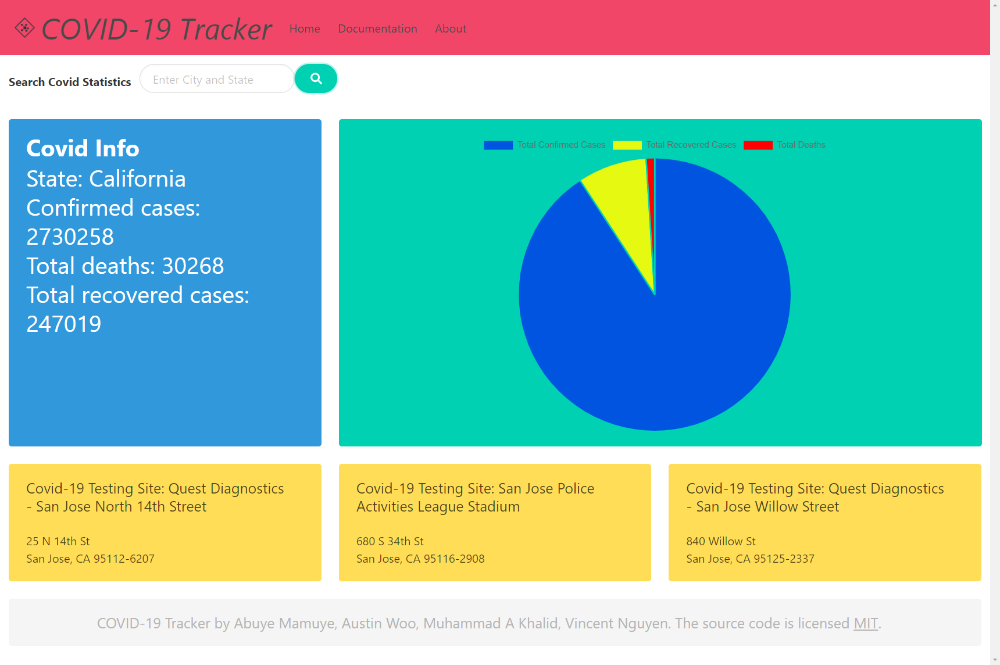

# COVID 19 Tracker

Find it before it finds you!



## Table of Contents
1. [Description](#description)
2. [Deployed Link](#deployed-link)
3. [How to Start](#how-to-start)
4. [Code Snippet](#code-snippet)
5. [Built with](#built-with)
6. [Licenses](#licenses)
7. [Author](#author)
8. [Acknowledgements](#acknowledgements)

-----------------------
## Description
In today’s society, many people are woefully uninformed regarding COVID-19. We want to help people be more aware of COVID-19, showcase current statistics of Covid in a given area, and provide important information to the public. We hope to provide the necessary resources to enlighten users of the real threat of COVID-19. 

-----------------------
## Deployed Link
https://austinwoo123.github.io/COVID-19-Tracker/

-----------------------
## How to Start
Enter a city or state in the Search bar and click on the Search icon. Click on the stats above the pie chart to	toggle on/off the individual stats.

-----------------------
## Code Snippets

```
if (!/^[a-zA-z][A-z\s]*$/i.test(searchTerm)) { 
  $("#errorModal").addClass("is-active") 
  $("#search-term").val(""); 
  return; 
}

$("#closeModal").click(function () {
  $("#errorModal").removeClass("is-active")
})

```
This code shows the text input validator that ensures the text will only include letters and spaces. It will add the is-active class to the errorModal selector which will display the modal to the user. The modal code allows the user to close the modal. This removes the is-active class from the modal which will hide it from the user. 

```
var ctx = document.getElementById('myChart').getContext('2d');
var chart = new Chart(ctx, {
  type: 'pie',
```
This code shows how we incorporated chart.js to create our own pie chart that compares our covid statistics together and display that on the page. 

```
var newH1 = $("<h1>");
var newArticle = $("<article>");
var topDiv = $("<div>");

var testingSiteStreet = $("<div>").text(testingSites.items[i].address.houseNumber + " " + testingSites.items[i].address.street);
var testingSiteCityStateZip = $("<div>").text(testingSites.items[i].address.city + ", " + testingSites.items[i].address.stateCode + " " + testingSites.items[i].address.postalCode);

newH1.addClass("subtitle").text(testingSites.items[i].title);
newArticle.addClass("tile is-child notification is-warning");
topDiv.addClass("tile is-parent is-4");

newArticle.append(newH1, testingSiteStreet, testingSiteCityStateZip);
topDiv.append(newArticle);

$("#testingSites").append(topDiv);
```
This code shows how we created new HTML elements to give one tile per testing location. We createdd the individual HTML elements and added the appropriate texts and classes. And finally, we appended it to the testingSites selector.

-----------------------
## Built With
- Chart JS
- Bulma CSS
- Javascript
- HTML/CSS
- HERE Geocoding and Search API
- Coronoavirus Smartable API

-----------------------
## Licenses

-----------------------
## Authors
- Abuye Mamuye
- Austin Woo
- Muhammad A Khalid
- Vincent Nguyen


-----------------------
## Acknowledgments
- Jerome Chenette (Instructor)
- Manuel Nunes (TA)
- Mahisha Manikandan (TA)
- UC Berkeley Coding Bootcamp